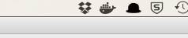

# README

Installation guide. 

## Ruby version
```
$ ruby -v 
ruby 2.4.0p0 (2016-12-24 revision 57164) [x86_64-darwin16]
```
# System dependencies

Go here to and choose your os version. http://railsapps.github.io/installing-rails.html 
Once you have your selected os, do everything up until the "Create a Workspace Folder"

you'll also need docker to run your postgres server. follow instructions to get docker and kitematic installed.

```
$ brew cask install docker 
$ brew cask install kitematic
```

once installed running this command should output this. and you should see in the toolbar above 
 see `/public/readme/docker.png` if the image is not displayed.



```
docker -v
Docker version 17.03.1-ce, build c6d412e
```
kitematic can be run from the docker dock. 

#Configuration
## Database creation

**postgresql installation**

Within Kitematic do a "+ new" search for postgres. There should be the default one from postgres. install that one.
Once you have it installed and running, Click on "Settings" => "Hostname / Ports" 
Change the port value under "published ip:port" to 9001


You will need to create a database use and password in the new postgres db. you can connect to the docker/postgres db via command line 
 or you can use your favorite gui. The instructions to use kitematic and comannd line are outlined here.

**Command line**

Within Kitematic, in the postgres image, click on the "exec" button, it will spawn open a terminal into the image.  

Inside of the terminal you will type this. 
```text
# psql -U postgres -W

```

It will then ask you for a password. hit enter. and you should see this. Hooray you are now commandline psql. 

```text
Password for user postgres: 
psql (9.6.3)
Type "help" for help.

postgres=# 
```

creating the development database and user.
```postgres-sql
create user mainer with password 'mainermainermainer';
alter role mainer superuser createrole createdb replication; 
create database mainer_development owner mainer;
```


## Database initialization

#### Hydration data
You'll need to procure data in order to hydrate the database, this is done via ruby script

**only run this if this directory ` dfp/raw ` doesn't exist.** 

before running the file, you'll need to populate 2 attributes in the class

```text
  @@token = 'Token token="**********"'
  @@basic = '**********'

```

**command to procure data.**
```text
  $ ruby /dfp/dataFetch.rb
```  


#### Rails db installation and data hydration.

in the command line, this will create the tables.  
```text
$ rails db:migrate
```


# Deployment instructions

once you have all this installed. you should be able to now run 

```text
rails server
```

and go to [http://localhost:3000](http://localhost:3000) and see the page.


